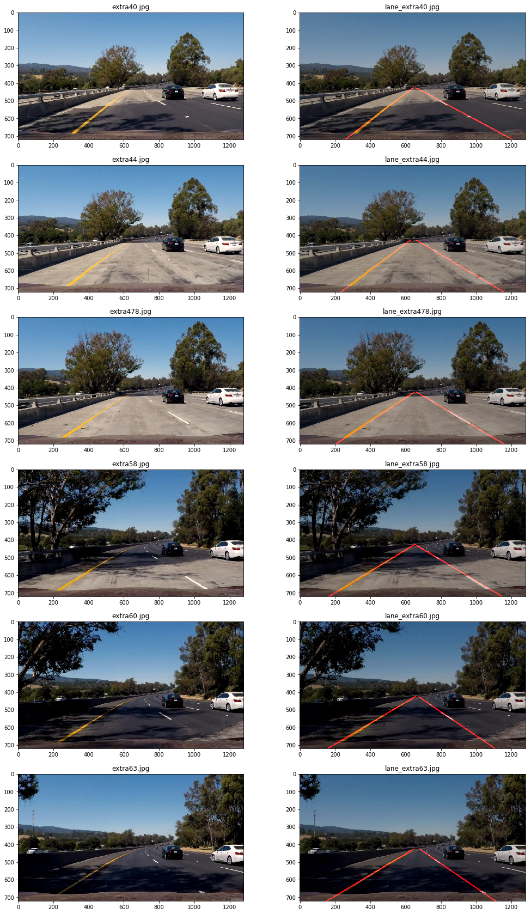

#**Finding Lane Lines on the Road** 
---
The goals / steps of this project are the following:
* Make a pipeline that finds lane lines on the road
* Test the pipeline on test images
* Test the pipeline on test videos
* Test the pipeline on challenge video and make adjustments
* Reflect on your work in a written report


[//]: # (Image References)

[image1]: ./examples/grayscale.jpg "Grayscale"

---

### Reflection

###1. Pipeline description

Main pipeline functionality is implemented in ```detect_lanes``` procedure.
Initial version of the pipeline consisted of common steps described in lessons' examples:

* Convert the image to grayscale
* Apply Gaussian smoothing
* Apply Canny edge detection
* Apply polygon mask
* Apply Hough algorithm on edge detected image
* Apply simple averaging of slopes and intercepts to draw single lines on the left and right lanes

Results looked quite satisfactory on **solidWhiteRight.mp4** and **solidYellowLeft.mp4** videos except redundant
shaking of the left and right lines. For **challenge.mp4** the pipeline didn't produce any sensible result.

Following problems were identified when working with **challenge.mp4**:

* Existance of non lane lines in the region of interest caused by shadows, road heterogeneities and car's front edge 
* Lane line dissapearing under sunlight or road heterogeneities
* Lane segments use to be curved  

In order to solve indetified problems following improvements have been implemented:

* Yellow and white lane lines are masked out before grayscale conversion of an input image. To make color selection easier RGB2HSV conversion is applied. It made yellow line visible under sunlight and partly eliminated non-lane lines. See ```detect_lanes``` procedure. 
* min_line_length is reduced to catch small fragments of lane lines. See ```parameters['min_line_length_p']```.
* Outliers in terms of slopes and intercepts of Hough lines are dropped out before averaging. See ```filter_lines``` procedure.
* Additional slope threshold was applied to eliminate other mild non-lane lines. See ```parameters['slope_threshold']```. 
* Slopes and intercepts of final two lines are updated by weighted averaging over slopes and intercepts from previous frames. It lets reduce redundant shaking of averaged lines. Weights are set to reduce linearly from 1 for the current frame to 0 in a defined frame in the past. Seems linearity makes sense under assuption of a constant velocity of the car. See ```frame_smooth``` procedure. 

Pipeline test on challenge selected images



###2. Potential shortcomings with the current pipeline

Let me list following shortcommings of the pipeline developed:

* The pipeline doesn't seem to work as well with more curved lane lines
* The pipeline doesn't take into account cars driving behind
* The region of interest has rigidly defined vertices making the pipeline less usefull when apex ("end of the road" position) is changing 
* Current solution implements very simple smoothing over historical data and lines are still shaking a little bit
* A lot more will come with deeper knowledge )

###3. Possible improvements

A possible improvement would be to implement more intelligent way to define the region of interest and use more elaborated approach to take historical data into account. Another potential improvement could be to implement current solution using object-oriented approach, so that the whole pipeline is incapsulated in a single class that can be reused through inheritance.
